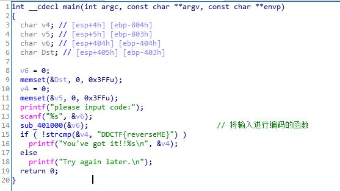
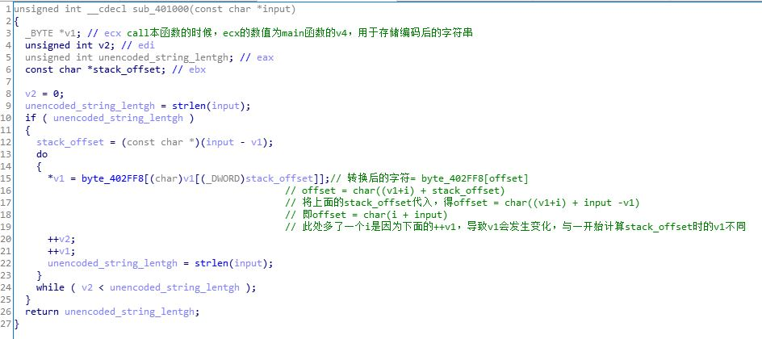
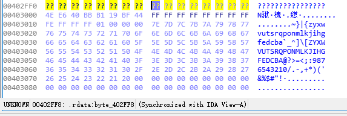

####  Windows Reverse1

> https://ddctf.didichuxing.com/files/74b0e73045c126f2bded00f4ae0bb1ff/reverse1_final.exe

下载binary，用file命令查看，是个Win 32程序，并且用UPX进行了压缩，用upx -d命令进行解压缩

```shell
$ file reverse1_final.exe
reverse1_final.exe: PE32 executable (console) Intel 80386, for MS Windows, UPX compressed

$ upx -d reverse1_final.exe
                       Ultimate Packer for eXecutables
                          Copyright (C) 1996 - 2013
UPX 3.91        Markus Oberhumer, Laszlo Molnar & John Reiser   Sep 30th 2013

        File size         Ratio      Format      Name
   --------------------   ------   -----------   -----------
      7680 <-      5632   73.33%    win32/pe     reverse1_final.exe

Unpacked 1 file.

```

然后用IDA打开进行分析

main函数获取用户输入，然后将输入的字符串传入函数sub_401000()进行编码，然后判断编码后的字符串是否等于DDCTF{reverseME}




sub_401000()这个函数对用户的输入根据一个表进行转换

转换方式为：逐字符取出用户的输入，将该字符的ascii码值作为表的偏移，取出表中相应位置的字符，然后放到main函数的v4中




关于这个表




然后现在的目的是输入一个字符串，让该字符串经过sub_401000()转换后，为DDCTF{reverseME}

附上计算脚本

```python
#!/usr/bin/python3
#coding: utf8
byte_list = []
for i in "DDCTF{reverseME}":
	byte_list.append(ord(i))

offset = []

for i in byte_list:
	offset.append(i - 0x20)

start = 0x403076
memory_address = []
for i in offset:
	#print(i)
	memory_address.append(start - i)

#for i in range(0, len(memory_address)):
#	print("%c : %x" %("DDCTF{reverseME}"[i], memory_address[i]))

for i in memory_address:
	print(chr(i-0x402FF8),end="")

```


```shell
$ python3 gen.py
ZZ[JX#,9(9,+9QY!
```

裹上DDCTF{}即为flag