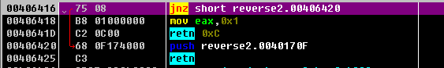

#### windows-reverse-2

> https://ddctf.didichuxing.com/files/2cc55adf06c537a9e9737bb3286d89bc/reverse2_final.exe

```shell
$ file reverse2_final.exe
reverse2_final.exe: PE32 executable (console) Intel 80386, for MS Windows
```

环境为Windows32 64bit，关闭了ASLR

是一个Windows程序，用peid查壳，aspack 2.12


第一次做这种带ASPack壳的题，网上搜了一下有脱壳机，试了一下，发现没法运行，导入ImportREC修复IAT会提示OEP无效，于是尝试手动脱。


用OD加载，程序会断在壳的加载点处。


这里根据ESP定律来脱壳

首先f7让pushad命令执行，将当前的寄存器全部入栈

然后右键寄存器窗口，选择HW break [ESP]，对ESP下硬件访问断点


然后F9执行，当程序对ESP进行修改时会触发中断

此时下面进行了push 0x40170F，然后retn，返回地址为0x40170F



F7单步执行，到达0x40170F


此时call了一个地址，下面jmp到的地址便是OEP，单步过去到达OEP（第一次到OEP应该会乱码，需要ctrl+a让OD重新分析）


右键OEP地址使用ollydump进行恢复


入口点偏移会自动填充好，点击脱壳保存文件，保存后不要关OD，有用


此时查壳能查到编译器信息，虽然还不能运行。想要运行需要修复IAT


ImportREC附加OD正在调试的进程


然后恢复IAT，OEP填写14B8（0x4014B8-镜像地址，镜像地址=0x400000)

点击按钮IAT自动搜索，然后点击获取导入表，然后再点击修正转储


选择修复的文件为刚才ollydump导出的文件


双击修复好的文件，运行正常（由于环境的问题，扔到win10还是会无法运行）

此时脱壳环节结束


用IDA加载，main函数分析如下


写脚本生成数据

```python
#!/usr/bin/python3
#coding: utf8
from base64 import *

flag_base64ed = "reverse+"

bin_input = b64decode(flag_base64ed.encode("ascii"))
flag = ""
for i in bin_input:
	flag+=hex(i)[2:].upper()

print("DDCTF{%s}" % flag)


```

