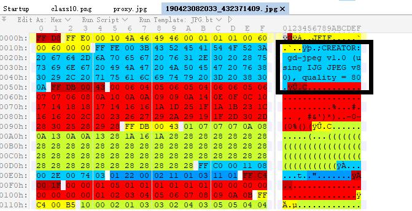
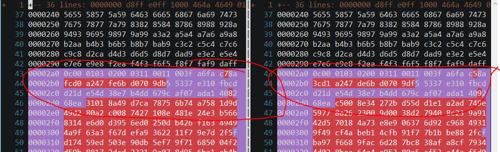
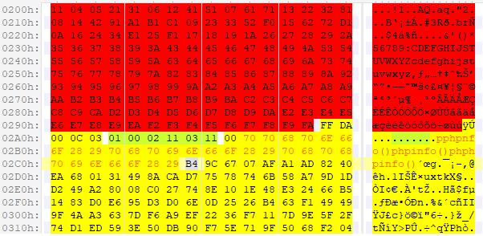

#### Upload-IMG

> <http://117.51.148.166/upload.php>

点开要求登录，同时试了一下账号密码跟web签到题conf目录的账密不一样。

这道题是一道图片上传题。

先正常上传一张图片，上传成功后提示`[Check Error]上传的图片源代码中未包含指定字符串:phpinfo()`

于是用burpsuite抓包，在图片数据的末尾加入phpinfo()，没有用。

把回显的图片下载到本地，用010 editor打开发现确实没有添加的数据了。不过发现了php-gd库的痕迹



以前入门的时候做过upload-labs，里面有一道题是用这个库进行了数据过滤

关于这个库的绕过姿势，可以将回显的图片再上传上去，然后对比哪些数据没有变化，在这些区域加入phpinfo()

```shell
$ hexdump -v 190423082033_432371409.jpg > 1
$ hexdump -v 190423083716_1669954_2.jpg > 2
$ vim -d 1 2
```



在这个区域加入了phpinfo()，发现还是不行，可能是跟quality=80有关，压缩掉了一些数据，于是又加了几遍

