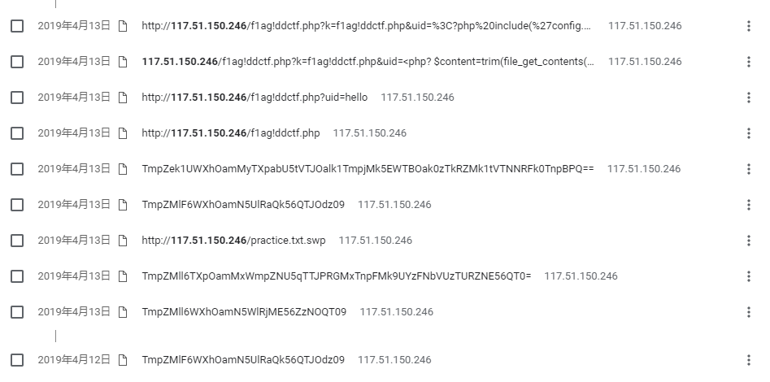

#### 滴~

2019-4-23

>地址: [http://117.51.150.246](http://117.51.150.246/)

emmmm写writeup的时候服务器已经关了。只能写一下大体的思路



首先访问题目链接，会重定向到index.php

然后访问的时候会传递一个base64编码的参数(如上图的历史记录的最下面那个）。把这个参数进行两次base64解码，得到一串十六进制表示的字符串，用chrome的扩展hackbar进行hex decode，得到flag.jpg这个文件名

考虑到这可能是个文件访问漏洞，将index.php根据编码规则进行编码，传递过去，得到了base64编码的源文件

源文件我记得大体的代码逻辑是将输入文件名进行过滤

然后发现注释里有个csdn博客的链接（可能是出题人的博客），在根据评论区的提示，翻了博主的另一篇关于vim的博客，讲到了一个文件名.practice.txt.swp，去网站访问还真有这个文件，然后给了一个flag!ddctf.php的php文件（具体的文件名忘掉了...，翻了下历史记录才找到)然后再利用index.php进行读这个文件的源码

```php
flag!xxxxx.php
<?php
include('config.php');
$k = 'hello';
extract($_GET);
if(isset($uid))
{
    $content=trim(file_get_contents($k));
    if($uid==$content)
    {
        echo $flag;
    }
    else
    {
        echo'hello';
    }
}

?>

```

要求访问时传入参数uid，然后判断uid与文件名为$k的内容是否相同，相同则打印flag

这里利用extract函数和file_get_contents的特性，将$k设置为php://input，这时file_get_contents的值为post过去的数据，将uid也设成同样的数据，就可以通过判断，拿到flag


这道题如果没有评论区的提示可能真做不出来...竟然把关键文件名放到另一篇博客中，还少个点