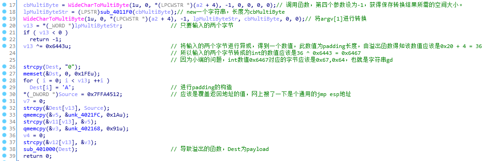

#### backdoor

binary: [vulnerable.rar.10d720f2dcf2b4133ec512813d7b89ce](http://ctf.leaflxh.com:3000/Jarvis/pwn/vulnerable.rar.10d720f2dcf2b4133ec512813d7b89ce)

>这是一个有后门的程序，有个参数可以触发该程序执行后门操作，请找到这个参数，并提交其SHA256摘要。(小写)
>
>FLAG：PCTF{参数的sha256}


扔到OD里发现缺少dll，网上下一个，扔到运行目录即可解决（为什么扔到目录就能解决，请搜索Windows加载动态链接库的位置索引顺序）

> Windows按下列顺序搜索DLL：
>
> 　　（1）当前进程的可执行模块所在的目录；（比如exe所在目录）
>
> 　　（2）当前目录；（比如工程所在目录）
>
> 　　（3）Windows 系统目录，通过GetSystemDirectory 函数可获得此目录的路径；（system32文件夹    内）
>
> 　　（4）Windows 目录，通过GetWindowsDirectory 函数可获得此目录的路径；（windows文件夹内）
>
> ​	（5）PATH 环境变量中列出的目录。（或者自定义的环境变量的目录）
>
>
> 原文：https://blog.csdn.net/u012234115/article/details/38949579 

main函数分析



```
>>> import hashlib
>>> hashlib.sha256("gd").hexdigest()
'2b88144311832d59ef138600c90be12a821c7cf01a9dc56a925893325c0af99f'
```

