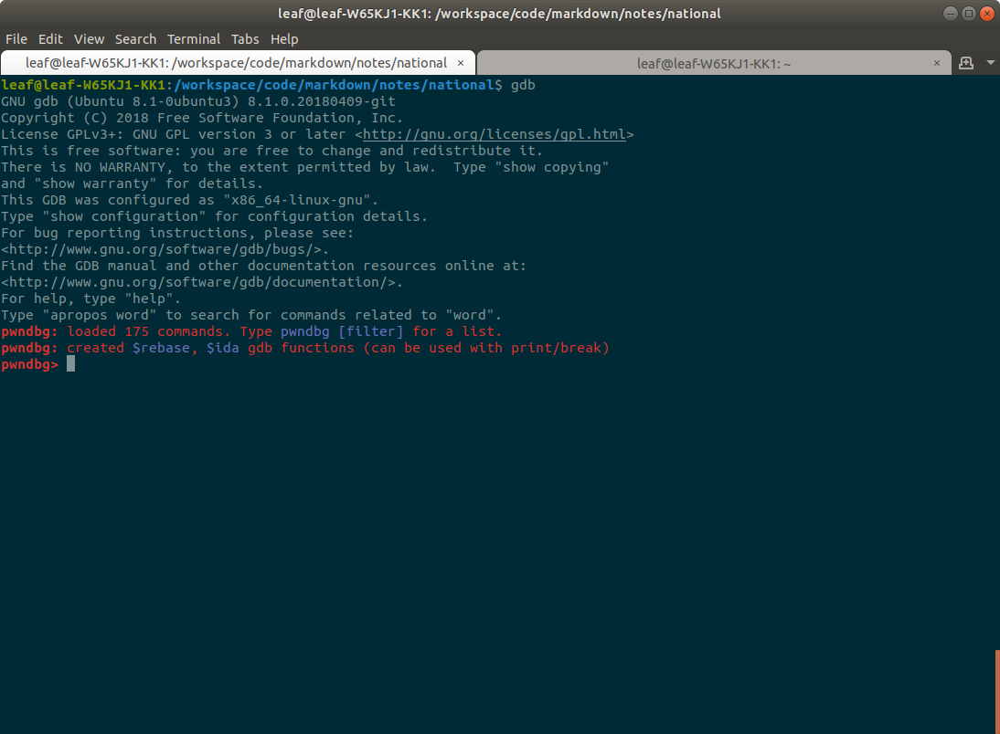

# 栈溢出从入门到入土

2019-4-2

此篇笔记用于记录我做过的一些题目，同时也可能在这个过程中总结一些经验


### 环境

**Ubuntu 18.04**

做pwn相关的题目需要一个Linux系统，推荐使用Ubuntu 18.04 (terminal好看而且相对于16.04还多了几个功能)

考虑使用虚拟机（不建议用Hyper-v，因为无法调整桌面的大小，建议用VMware)

或者直接在电脑上装双系统（要求对自己装系统的技术十分自信，而且很能折腾，不要像我一样因为失误把整个硬盘格了两次，还被各种各样的问题把系统重装了无数遍....感谢Ubuntu提高了我的动手能力）




**gdb**


因为pwndbg推荐在Ubuntu 16.04下使用gdb 7.11，如果你的gdb版本满足需求则不需要安装, 我这里为了作者说的那句话，所以从源码安装

曾经测试过在gdb 8下也能够正常运行pwndbg, 所以你也可以尝试用其他版本的gdb...请自行测试

从源码安装需要注意，要把你的python可执行文件的位置传给配置文件（下面的第四条命令, 我的python版本是3.5）

因为下面的两个插件都需要使用到python。我这里用的是python3.5, 没有尝试使用python2

\`which python3.5\` ==> /usr/bin/python3.5

```
wget http://ftp.gnu.org/gnu/gdb/gdb-7.11.tar.gz
tar zxvf gdb-7.11.tar.gz
cd gdb-7.11
./configure --with-python=`which python3.5`
make && sudo make install
```

**pwndbg**

pwndbg是一款gdb插件，可以即时显示程序的汇编代码，寄存器的数值，还可以查看已分配的堆的情况，增强gdb的使用体验

git clone以及pip install 的下载速度可能会非常慢，尝试挂代理(ss + proxychains)解决

```
git clone https://github.com/pwndbg/pwndbg.git
cd pwndbg*
./setup.sh
```
**peda**

peda也是一款gdb插件，也可以即时显示汇编代码以及寄存器的数值，功能上与pwndbg有一些重复。可以考虑不装，只使用pwndbg，因为暂时没找到用peda看堆的方法，而且两个插件不能同时开启

```

```


python2-pwntools


