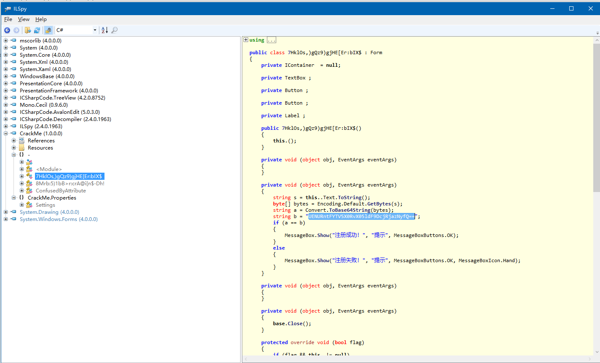

#### Classical Crackme

binary: [CrackMe.rar.4b81595bfc90d446ba30f9c9bb03fb49](http://ctf.leaflxh.com:3000/Jarvis/reverse/CrackMe.rar.4b81595bfc90d446ba30f9c9bb03fb49)

> 经典Crackme题目，FLAG就是注册码。


file命令查看发现是用了.NET框架写的

```
$ file CrackMe.exe
CrackMe.exe: PE32 executable (GUI) Intel 80386 Mono/.Net assembly, for MS Windows
```


扔到IDA里没看出什么，扔到ILSpy看看



虽经对函数名进行了混淆，但是程序本身很小，没多少函数，很快就找到了验证逻辑，注册码是一串经过base64编码的字符串

```
$ echo "UENURntFYTV5X0RvX05ldF9DcjRjazNyfQ==" | base64 -d
PCTF{Ea5y_Do_Net_Cr4ck3r}
```


由于.NET的特性，我们可以通过使用工具（ILSpy) 直接拿到程序的源代码，当然这些代码可能会做混淆