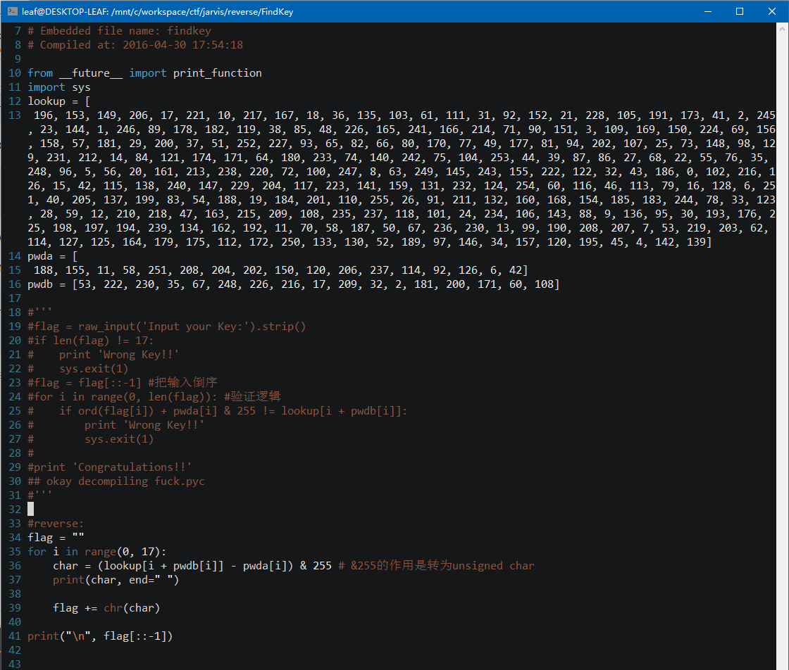

#### FindKey

binary: [findkey.31a509f4006ba41368dcf963762388bb](http://ctf.leaflxh.com:3000/Jarvis/reverse/findkey.31a509f4006ba41368dcf963762388bb)

> FLAG就是你输入的key


file命令看一下文件


```
$ file findkey.31a509f4006ba41368dcf963762388bb
findkey.31a509f4006ba41368dcf963762388bb: python 2.7 byte-compiled
```

是一个python2.7编译的Python程序


pyc文件是可以反编译的


首先装个pyc的反编译工具：

```
$ sudo python -m pip install uncompyle6
```

然后反编译,得到源代码（吐槽一下这个工具竟然判断文件后缀名-。-#）：

```
$ uncompyle6 findkey.31a509f4006ba41368dcf963762388bb> findkey.py

# file findkey.31a509f4006ba41368dcf963762388bb
# path findkey.31a509f4006ba41368dcf963762388bb must point to a .py or .pyc file

$ cp findkey.31a509f4006ba41368dcf963762388bb fuck.pyc
$ uncompyle6  fuck.pyc >findkey.py

```



运行：

```
$ python findkey.py
125 114 51 107 99 52 114 67 95 67 121 80 123 70 84 67 80
 PCTF{PyC_Cr4ck3r}

```

