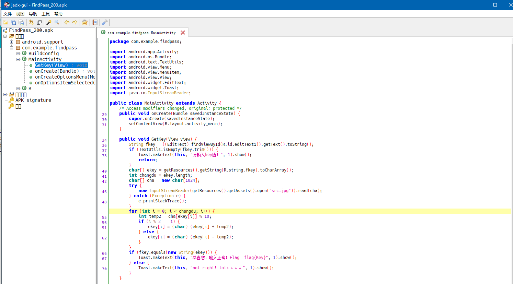

#### FindPass

 binary: [FindPass_200.apk.722003c4d7d4c8b37f0eaa5f7109e87a](http://ctf.leaflxh.com:3000/Jarvis/reverse/FindPass_200.apk.722003c4d7d4c8b37f0eaa5f7109e87a)

> 无简介


file命令查看，是个apk文件

关于安卓的逆向肯定少不了几个工具：dex2jar-2.0， jd-gui，,apktool，jadx

[52破解网盘上可以下载到](https://down.52pojie.cn/Tools/Android_Tools/)


首先用dex2jar-2.0把apk转成jar包，方法是把apk文件拖到d2j-dex2jar.bat


在apk的目录下获得一个jar包


然后用jd-gui查看这个jar包，查看程序的源代码


这个程序没多少函数，很快就找到了判断逻辑，大体上是key保存在一个字符串中(`char[] arrayOfChar1 = getResources().getString(2131034115).toCharArray();`)，这个字符串资源ID是2131034115，在jd-gui中能找到这个id对应的字符串资源名称是fkey。如果用户输入和这个字符串相匹配显示输入正确


至于为什么字符串会存储到资源中，你需要去玩玩安卓开发（可以玩玩Android studio，一个谷歌开发的写安卓程序的IDE），好像是为了方便本地化，所以把字符串存到资源里。


这里需要拿到这个软件用的资源（resource）。上面的两个工具只能拿到程序的源代码，想要拿到资源需要用到另一个工具：apktool

这款工具可以拿到apk文件中的资源，比如图片，字符串之类的

安装及配置：<https://ibotpeaches.github.io/Apktool/install/>

使用：

```shell
$ apktool d -f FindPass_200.apk.722003c4d7d4c8b37f0eaa5f7109e87a
I: Using Apktool 2.4.0 on FindPass_200.apk.722003c4d7d4c8b37f0eaa5f7109e87a
I: Loading resource table...
I: Decoding AndroidManifest.xml with resources...
S: WARNING: Could not write to (/home/leaf/.local/share/apktool/framework), using /tmp instead...
S: Please be aware this is a volatile directory and frameworks could go missing, please utilize --frame-path if the default storage directory is unavailable
I: Loading resource table from file: /tmp/1.apk
I: Regular manifest package...
I: Decoding file-resources...
I: Decoding values */* XMLs...
I: Baksmaling classes.dex...
I: Copying assets and libs...
I: Copying unknown files...
I: Copying original files...

$ ls
FindPass_200.apk.722003c4d7d4c8b37f0eaa5f7109e87a      FindPass_200.apk-dex2jar
FindPass_200.apk.722003c4d7d4c8b37f0eaa5f7109e87a.out  FindPass_200.apk-dex2jar.jar

$ cd FindPass_200.apk.722003c4d7d4c8b37f0eaa5f7109e87a.out/
$ ls
AndroidManifest.xml  apktool.yml  assets  original  res  smali
```

在上面我们使用了apktool解包了这个apk，这里不知道字符串资源在那个文件中保存，翻一翻文件，最终找到了

```shell
FindPass_200.apk.722003c4d7d4c8b37f0eaa5f7109e87a.out/res/values$ cat strings.xml
<?xml version="1.0" encoding="utf-8"?>
<resources>
    <string name="app_name">FindPass</string>
    <string name="hello_world">Hello world!</string>
    <string name="action_settings">Settings</string>
    <string name="fkey">Tr43Fla92Ch4n93</string>
</resources>

```


fkey=Tr43Fla92Ch4n93


做到最后发现jd-gui反编译出来的代码是错的.....

换了个工具：jadx-gui



src.jpg在apktool解包结果的assert目录下（突然发现7z也可以解包）


用了Python和C++发现都不能算出正确的答案，网上一搜说是java的char是两个字节大小的，干脆还是用Java写吧....

```java
import java.io.FileInputStream;
import java.io.InputStreamReader;
public class gen
{
    public static void main(String[] args)
    {
        char[] ekey = "Tr43Fla92Ch4n93".toCharArray();
        int changdu = ekey.length;
        char[] cha = new char[1024];

        try
        {
            new InputStreamReader(new FileInputStream("src.jpg")).read(cha);
        }
        catch(Exception e1)
        {
            e1.printStackTrace();
        }

        for (int i = 0; i < changdu; i++) {
            int temp2 = cha[ekey[i]] % 10;
            if (i % 2 == 1) {
                ekey[i] = (char) (ekey[i] + temp2);
            } else {
                ekey[i] = (char) (ekey[i] - temp2);
            }
        }

        System.out.println(ekey);

    }
}
```

```shell
$ javac gen.java && java gen
flag{Qv49CmZB2Df4jB-}
```


网上有动态调试的办法，可以直接拿到flag，有兴趣的可以看看