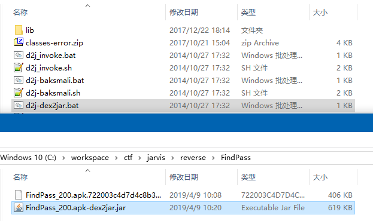
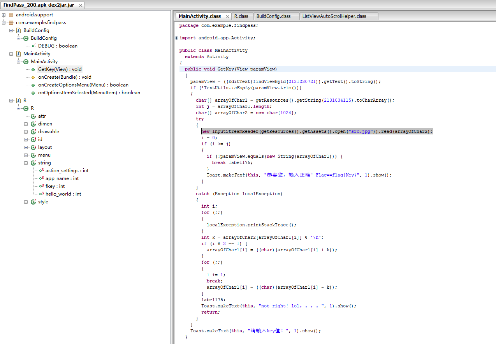

#### FindPass

 binary: [FindPass_200.apk.722003c4d7d4c8b37f0eaa5f7109e87a](http://ctf.leaflxh.com:3000/Jarvis/reverse/FindPass_200.apk.722003c4d7d4c8b37f0eaa5f7109e87a)

> 无简介

file命令查看，是个apk文件

关于安卓的逆向肯定少不了几个工具：dex2jar-2.0， jd-gui

首先用dex2jar-2.0把apk转成jar包，方法是把apk文件拖到d2j-dex2jar.bat

在apk的目录下获得一个jar包

然后用jd-gui查看这个jar包，查看程序的源代码

这个程序没多少函数，很快就找到了判断逻辑，大体上是key保存在src.jpg中，然后读取用户输入，判断数据是否与src.jpg中的数据一样

这里需要拿到src.jpg。上面的两个工具只能拿到程序的源代码，想要拿到图片需要用到另一个工具：apktool

这款工具可以拿到apk文件中的资源，比如图片之类的

安装：<https://ibotpeaches.github.io/Apktool/install/>

