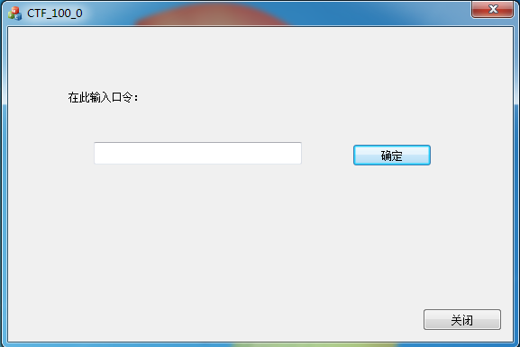
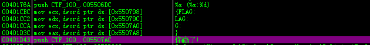
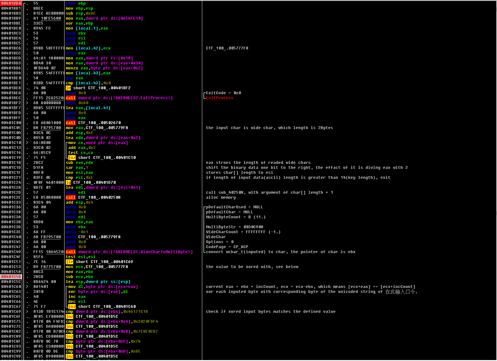

#### 软件密码破解-1

binary:

 [CTF_100_0.rar.b5abee530fee7cdae2f5cdc33bb849e8](http://ctf.leaflxh.com:3000/Jarvis/reverse/CTF_100_0.rar.b5abee530fee7cdae2f5cdc33bb849e8)

> 请对压缩包中的程序进行分析并获取flag。flag形式为xxx-xxxxx_xxxx。


题目给了一个压缩文件，里面是一个windows程序，CTF_100_0.exe

从图标看出来是用MFC写的。只有一个按钮和编辑框，按下按钮后程序直接退出，无回显



一开始搜了一下字符串，没有发现有用的字符串

由于是MFC写的，还没有回显，我又想到通过MFC的消息机制来定位按钮的响应函数，不过之前没找过，看了网上的教程还是云里雾里...

网上搜了一下writeup，说是可以通过OD的搜索字符串来定位。

内心：emmmmmmm



然后双击了过去，通过下断的方式确定了是这个按钮的响应函数(看不清的话打开图片到新标签)



这个函数做了这么几个事情：

1.是从编辑框中读取输入的文本，读入数据为Unicode编码

2.判断文本长度，如果大于14则直接跳过下面的验证过程

3.将输入的数据通过WideCharToMultiByte函数（Windows api）转成单字节存储（Unicode的每个字符占用2个字节）

4.将输入的数据的每个字节与Unicode字符串`在此输入口令：`的对应位置的字节进行xor运算

5.判断经过xor运算的输入数据是否符合指定的数据，如果符合，则弹框，显示flag为 {FLAG:你的输入}


由于是把我们输入的数据与一串值进行xor运算，然后将其与指定的数据做比较，那么我们可以通过xor运算的特性，将指定的数据与那一串值进行xor运算反向拿到符合要求的输入


通过分析汇编代码（那几个cmp jnz), 得知指定的值为：0x46171C1B,  0x3020FDF4, 0x7E8E0CB7, 0x78 ,0xDE

通过查看内存， 那一串值为 0x28, 0x57, 0x64, 0x6B, 0x93, 0x8F, 0x65, 0x51, 0xE3, 0x53, 0xE4, 0x4E, 0x1A, 0xFF


有了这两个数据我们便可以进行运算，拿到符合要求的输入。


在运算的时候需要注意大小端的问题，也就是这个4字节的十六进制数据的读取问题，Windows用的是小端，**也就是从低位开始读**，所以指定的值对应的字节为

0x46171C1B ==》0x1B, 0x1C, 0x17, 0x46

0x3020FDF4 ==》0xF4, 0xFD, 0x20, 0x30

........

合起来，即：

0x1B, 0x1C, 0x17, 0x46, 0xF4, 0xFD, 0x20, 0x30, 0xB7, 0x0C, 0x8E, 0x7E, 0x78, 0xDE

这里懒得手工算，写了一段脚本

```python
s1 = "46171C1B"
s2 = "3020FDF4"
s3 = "7E8E0CB7"
def do(s):
    '''convert to little-endian format array'''
    for i in range(4, 0, -1):
        print("0x" + s[int(i*2-2):int(i*2)], end=", ")

def gen():
    '''xor compute, generate flag'''
    result = [0x1B, 0x1C, 0x17, 0x46, 0xF4, 0xFD, 0x20, 0x30, 0xB7, 0x0C, 0x8E, 0x7E, 0x78, 0xDE]
    key = [0x28, 0x57, 0x64, 0x6B, 0x93, 0x8F, 0x65, 0x51, 0xE3, 0x53, 0xE4, 0x4E, 0x1A, 0xFF]
    index = 0
    for i in result:
        print(chr(i^key[index]), end="")
        index+=1
gen()


```

得到结果：

```
$ python3 test.py
3Ks-grEaT_j0b!
```


还是打算通过MFC消息机制来定位按钮响应函数，通过字符串查找实在很看脸，这道题是搜出来几百个字符串，鼠标一划没发现关键字符串