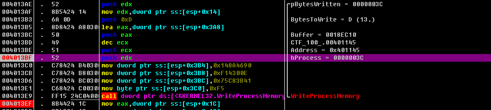
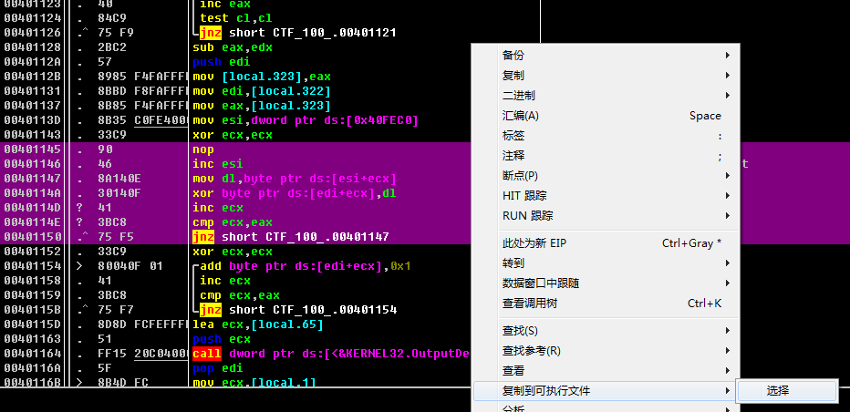
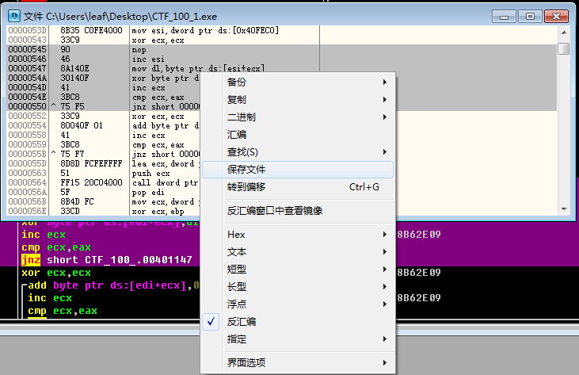
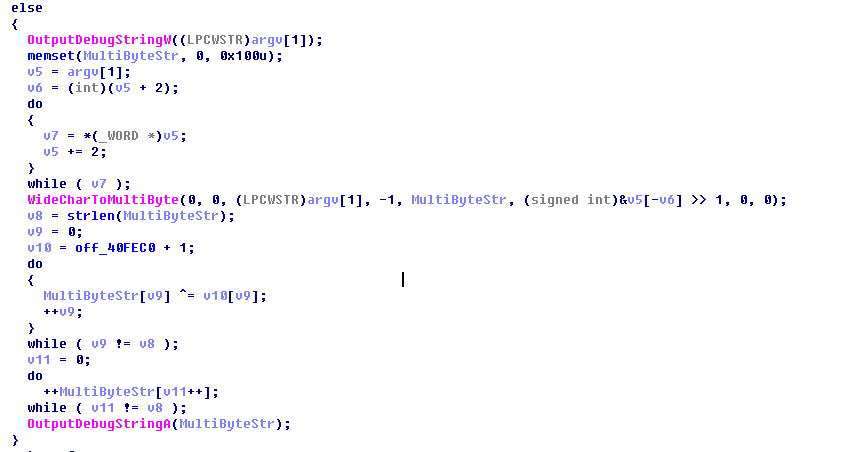
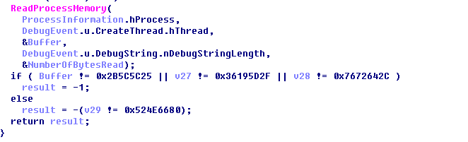

#### 软件密码破解-2

binary: [CTF_100_1.rar.aa33faecac5307c4b1021a072e90e1d3](http://ctf.leaflxh.com:3000/Jarvis/reverse/CTF_100_1.rar.aa33faecac5307c4b1021a072e90e1d3)

>对压缩包中的程序进行分析并获取flag。flag形式为16位大写md5。
>
>题目来源：CFF2016


运行了一下发现是个Win32控制台程序，扔到IDA看一下，发现不能F5 main函数。

用OD进行动态调试分析，发现：

1. 双击正常运行程序，会弹出要你输入信息的提示。如果在运行程序的时候有参数，则main函数的逻辑是对传递进来的参数进行一定算法的处理，但是该算法被人工破坏了。
2. 接收到输入的信息后，获取本身的可执行文件的位置，传入CreateProcessW，创建一个和本身一样的子进程，参数为输入的信息，并使用调试模式创建该进程。创建的进程因为有参数，main函数的执行逻辑与父进程不一样。
3. **通过WriteProcessMemory恢复子进程的main函数中被破坏的部分**。
4. 读取子进程运算的结果，判断结果是否与预期的数据相同，如果相同则打印flag{你的输入}，否则直接退出


由于不给子进程做点手段没法再被挂载调试器，可以在父进程的WriteProcessMemory执行处下一个断点，修改传入到该函数的进程句柄（HANDLE hProcess）为-1（即本进程），这样写内存是写到自身进程的，然后用OD的保存功能拿到修复好的可执行文件，然后再分析这个修好的可执行文件

关于修改WriteProcessMemory的进程句柄：

根据OD的提示，在push hProcess到栈中之前修改对应的寄存器数值为-1




F8步过WriteProcessMemory后，到写入的位置（0x401145），选中被修复的汇编代码，右键，复制到可执行文件->选择



在新弹出的窗口中，右键自动选中的部分,保存文件



把恢复的可执行文件拖到IDA中，可以F5 main函数了。


关于加密算法：




验证逻辑(sub_401180)：




反算脚本：

```python
#coding: utf8

result = ["2B5C5C25", "36195D2F", "7672642C", "524E6680"]

v10 = "Welcome to CFF test!"[1:]

#gen result bytes

result_bytes = []
for dword in result:
    for index in range(4, 0, -1):
        result_bytes.append(int(dword[index*2-2:index*2], 16))

for i in range(0, 16):
    print("%c" %((result_bytes[i]-1)^ord(v10[i])), end="")
```


```
$ python3 run.py
A78EC98ADC239E94
```

