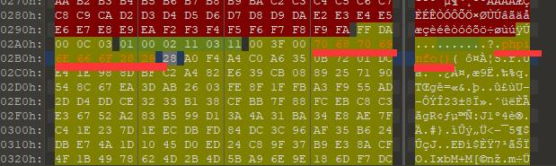

#### Upload-IMG

><http://117.51.148.166/upload.php>
>
>user：dd@ctf
>pass：DD@ctf#000

打开网站，登录过去后是一个文件上传的页面，查看网页源码没有什么特别的东西

随便上传一张图片，得知要求文件的数据中包含phpinfo()

于是开启burpsuite，抓取上传图片的HTTP包，在图片数据中的各个位置加入phpinfo()，发现没有什么用.....

有时候甚至提示上传的文件格式有误（我没有动文件头）

不过页面显示了我们上传的图片，右键下载下来，用strings命令发现下载到的图片已经没有加入的字符串了

同时还发现多了这么一行数据

> ;CREATOR: gd-jpeg v1.0 (using IJG JPEG v80), quality = 76

记着曾做过upload-labs，里面有道题是将上传的文件进行了重新生成，来过滤掉上传的图片中包含的非图片数据。
不过已经好几个月没碰忘掉了...

谷歌了一下文件上传绕过的姿势，[在一篇文章里](https://www.cnblogs.com/ssooking/articles/6567912.html)发现那一行数据代表着后端使用了php-gd库将图片进行了二次生成

然后我发现我即使上传gif图片，最终服务器传回来的文件头还是jpeg格式的（我谷歌了一会发现不同的图片格式可能绕过方式有些不同，这里也是庆幸题目生成的jpeg格式刚好有人做过相关的exploit，关于png文件格式的我没看懂）

谷歌了一下php-gd库的绕过，找到了[一篇关于绕过的文章](https://github.com/fakhrizulkifli/Defeating-PHP-GD-imagecreatefromjpeg)

**大体上就是说用这个库生成的jpeg图片，有一段区域的数据即便是用这个库进行重新生成jpeg图片，也不会发生改变。**

#### 下面这张图是关于那个区域的说明

jpeg文件中有一段区域叫做Start of Scan（缩写为SOS），这个区域的前两个字节（FF DA，图中红色标记）用来标识这个区域是SOS。（对于绕过来讲，通过这两个字节可以定位到这个SOS区域）

紧接着数据是是扫描头（scan header），扫描头的前两个字节指明了这个扫描头的长度，00 0C的十进制表示为12，也就是说这个扫描头是12个字节，扫描头剩下的这10个字节我暂时不知道是干什么的....（对于绕过来讲，通过这个大小用来定位下面的扫描数据位置）

扫描头紧接着的是扫描数据（褐色标记，关于“扫描数据”这个翻译我不太确定，图里的俄文我表示emmm......），网上搜了一下好像是这个图片的压缩数据。（想了解详细信息的话建议谷歌一下。）那篇文章里说可以在这块区域写入数据，这块数据经过再次生成，不会发生变化（个人经历可能会变，不知为何...）（对于绕过来讲，通过在这个区域放置恶意代码来防止其在重新生成过程中被过滤掉）

#### 说完了上面的绕过原理开始将这个题的做题过程

首先我找了一张jpg图片（其他格式未测试） ，上传到服务器，然后把页面回显给我的图片保存下来。

（说到这我忘了讲上面文章说的一个重要的问题，就是你可以在自己的电脑上生成第一次生成的图片，**但一定要确保你电脑上php-gd库的版本要和目标服务器后端用的php-gd库的版本相同**，否则可能会因为版本问题导致恶意代码被过滤掉。所以在这道题里因为我不知道后台库版本，以及能下到目标服务器生成的图片，所以我没有在自己的电脑上生成那张生成图片（怎么感觉有点绕....））

我这里用的二进制编辑器是 010 Editor（[下载](https://www.sweetscape.com/)），这个编辑器自带模板，可以解析文件，显示其中的结构。

把图片拖到编辑器里面（第一次用会提示安装模板，安装就好）

然后你可以control+F去手动搜索字节FFDA来定位SOS区域，也可以用模板提供的解析功能，点一下下面的列表`struct SOS scanStart`程序会自动定位并选中SOS的前几个字节

根据上面讲的结构，定位到扫描数据的位置，然后在这个区域(图中黑色框部分）写入phpinfo()

（点一下那块数据，键盘按下去会自动覆盖，control+s保存）

提交上去，拿到了flag

(第一次做的时候(写这篇writeup时是第二次做)提交上去，发现还是不行，下载下来发现少了几个字母。然后我把phpinfo()这个字符串往那个区域里粘贴了好几遍，再提交上去)