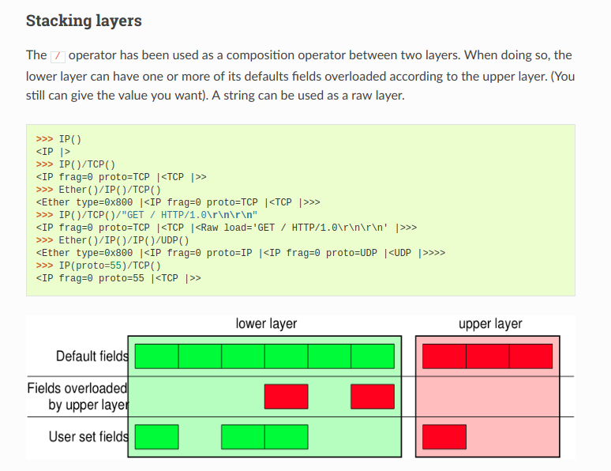
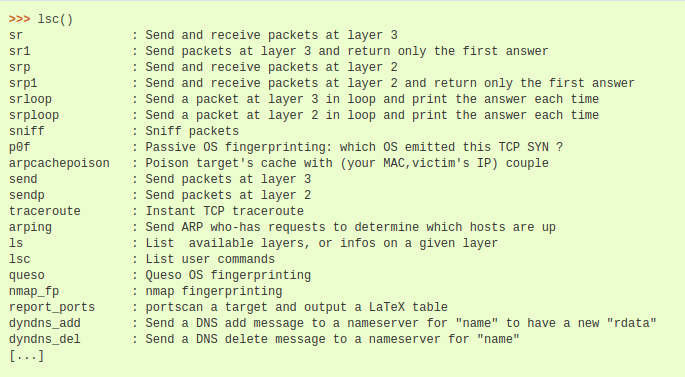

# python scapy库


## 基础知识
####  ARP帧结构

>以太网头部  
>>以太网目的地址： 6字节（48位）的目的地MAC地址数值  
>>以太网源地址：6字节报文发送者的MAC地址数值  
>>帧类型：表示后面的是什么数据。ARP报文为0x806  
>  
>ARP报文
>>硬件类型：表示硬件地址的类型，ARP报文中使用1，代表MAC地址  
>>协议类型：表示要映射的协议地址类型。0x0800即表示IP地址。  
>>硬件地址长度：地址长度，单位为字节。硬件地址长度为6字节  
>>协议地址长度：地址长度，单位为字节。IP地址长度为4字节  
>>op(opration code)：操作码。1表示ARP请求报文，2表示ARP回应报文。RARP的请求和回应分别为3和4  
>>发送端以太网地址：发送者的以太网地址  
>>发送端IP地址：发送者的IP地址  
>>目的以太网地址： 接收ARP包的主机。当报文为请求的时候，可以不填
>>目的IP地址：接收ARP包的主机的IP地址。当报文为请求的时候，为被查询者的IP地址  

>ARP请求填充：
>>以太网头部：以太网目的地址=广播地址，以太网源地址=本机MAC地址  
>>
>>ARP报文：op=1，发送端以太网地址=本机MAC地址，发送端IP地址=本机IP地址， 目的以太网地址=空， 目的IP地址=想要查询的IP地址   
>
>ARP回应填充：
>>以太网头部：以太网目的地址=广播地址，以太网源地址=本机MAC地址   
>>
>>ARP报文：op=2，发送端以太网地址=告诉查询者的MAC地址，也就是本机MAC地址，发送端IP地址=查询者查询的IP地址，也就是本机IP地址， 目的以太网地址=查询者的MAC地址， 目的IP地址=查询者的IP地址  
>
>接收ARP回应报文的主机会将发送端以太网地址和发送端IP地址存入ARP缓存表中

#### scapy库  
使用scapy库可以构造基于OSI参考模型的数据包，常用的Layer有 Ether、IP、ARP()、UDP、TCP、UDP。这些协议的包如果不手动指定其中field的数值，scapy会自动根据环境进行指定。  
构造发送的包的时候，可以指定不只一个layer的包的数值。可以将多个layer的包的数值进行叠加:  



## scapy库的使用  
### 命名空间设定：from scapy.all import *
#### 发包  
函数：  



常用函数：  
>send()发送网络层报文  (IP, ARP, etc.)   
>sr()发送网络层报文,并接收网络层报文  
>sr1()发送网络层报文，只接收第一个响应的网络层报文  
>sendp()发送链路层报文  (Ethernet, 802.3, etc.)  
>srp()发送链路层报文,并接收链路层报文  
>srp1()发送链路层报文，只接收第一个响应的报文  
>srloop()循环发送网络层报文，并打印结果  
>srploop()循环发送传输层报文，并打印结果  

指定发包接口:  
conf.iface="网卡名称"
#### 构造IP数据包
```
IP(dst=目标IP地址或主机名(会自动进行DNS解析))
```
#### 构造ARP数据包
```python
ARP(op=操作码, psrc=发送端IP地址字符串, hwsrc=发送端MAC地址字符串, pdst=目的IP地址字符串, hwdst=目的MAC地址字符串)
```
## ARP协议利用
攻击者通过构造ARP报文，可修改目标主机中的ARP动态表项。

#### ARP欺骗实战
网络拓扑：  
web服务器 192.168.200.10 :00:0c:29:12:c4:1e
受害者电脑 192.168.200.20 00:0c:29:8f:b6:a5
攻击者电脑 192.168.200.86 80:fa:5b:42:dc:67  

攻击者：  
开启tcp转发  
\# echo "1" > /proc/sys/net/ipv4/ip_forward

python脚本
```python

conf.iface="enp2s0f1"
```
