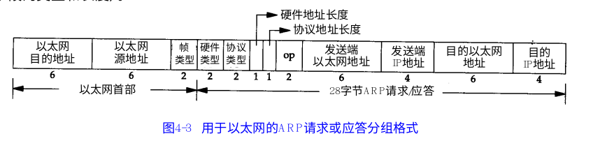

# python scapy库

## ARP
#### 基础知识
ARP帧结构

以太网目的地址： 6字节（48位）的目的地MAC地址数值
以太网源地址：6字节报文发送者的MAC地址数值
帧类型：表示后面的是什么数据。ARP报文为0x806

#### 查询IP地址对应的MAC地址
```python
>> res = sr1(ARP(pdst="10.10.10.10"))
>> res.hwsrc
'ea:bb:cc:ee:1d:db'
```

